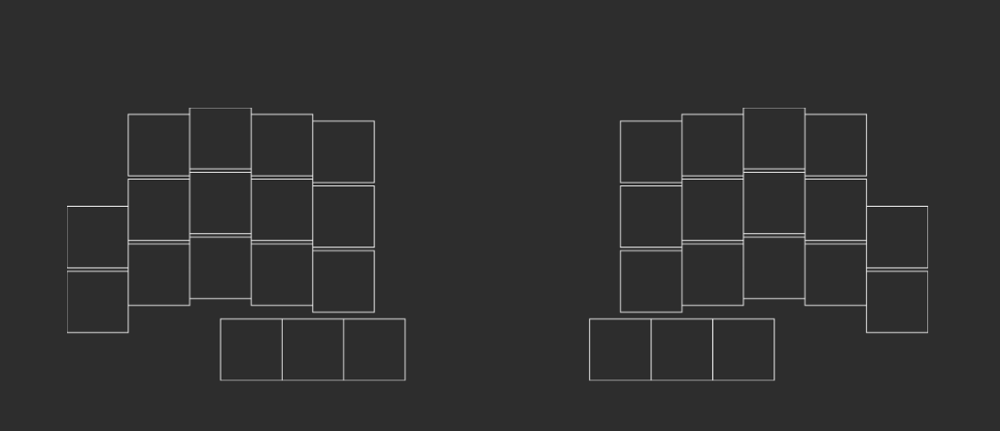

<h1 align="center">Catpucciano</h1>

Catpucciano is 34 key key column-staggered choc split keyboard using a SEEED XIAO BLE and inspired by [TOTEM](https://github.com/GEIGEIGEIST/TOTEM/tree/main)

\

---

## Layout

---

## BUILD GUIDE

---

## FILES

### PCB

### CASE
Printed in two sections with FDM Printer  
3mf for all three files [Case](<./docs/Case Files/Case.3mf>)  
[Case](<./docs/Case Files/Case.stl>)  
[Top](<./docs/Case/Top Case.stl>)  
[Top with imbedded Magnets](<./docs/Case Files/Top Magnet.stl>)  
[Tenting Case 45 Degrees](<./docs/Case Files/Tenting Case 45.stl>)  

---

## FIRMWARE

---

## Credits

### I like the [TOTEM](https://github.com/GEIGEIGEIST/TOTEM/tree/main) by GEIST but not a fan of the splayed layout and wanted something more compact. Having the thumb cluster angled also makes it somewhat awkaward with it sticking out. I removed the upper corner keys to make the keyboard as small as possible to maximize desk space and portability.
